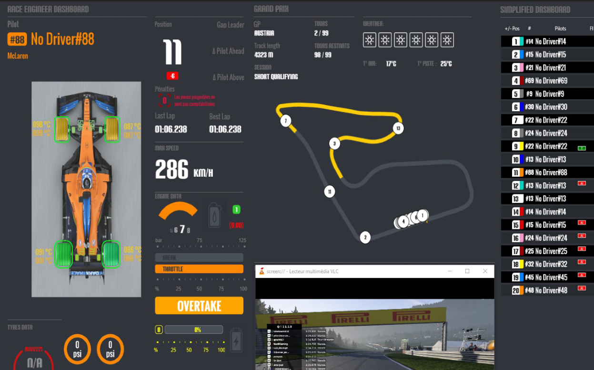
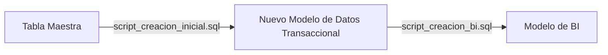
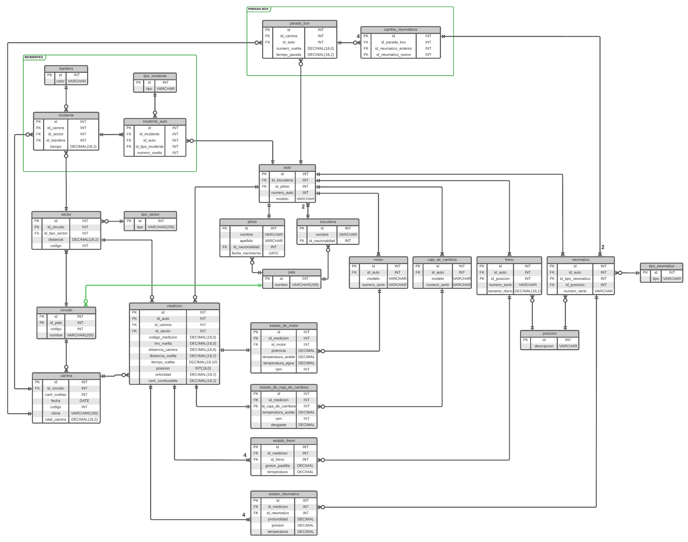
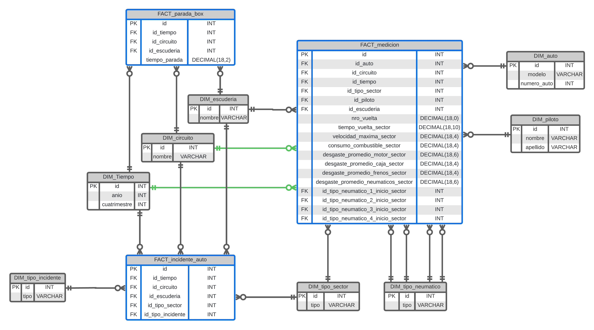

# Telemetria Formula 1 🏁

👋 El propósito de este proyecto es simular la implementación de un software para la gestión de carreras de autos de Fórmula 1, teniendo como principal función la recolección y centralización de información de telemetría generada por los sensores de los autos de las distintas escuderías.

Para este proyecto se provee un script (gd_esquema.Maestra.Table.7z) que permite crear un esquema sobre una base de datos en el motor SQL Server. Este incluye una única tabla, llamada maestra.

> 📌 **Nota sobre los datos:** gd_esquema.Maestra.Table.7z posee un tamaño aproximado de 1 GB al descomprimirse.

## Objetivos

- Analizar los datos contenidos en la tabla maestra
- Confeccionar un nuevo modelo de datos transaccional (ver `Detalles del Modelo de Datos Transaccional`).
- Desarrollar un script en T-SQL para SQL Server que realice la creación del nuevo modelo de datos transaccional y la migración de los datos de la tabla maestra al nuevo modelo. 
- Desarrollar otro script en el cual se implemente un modelo de inteligencia de negocios que permita obtener información para un tablero de control (ver `Detalles del Modelo de Inteligencia de Negocios (BI)`). Este script tambien debe migrar los datos del nuevo sistema transaccional a dicho modelo de datos.
- Considerar la performance a la hora de realizar consultas SQL.

 

Detalles del Modelo de Datos Transaccional

 

# Modelo de Datos Transaccional

Todas las columnas creadas para las nuevas tablas deberán respetar los mismos tipos de datos de las columnas existentes en la tabla principal. A su vez se podrá crear nuevas columnas, claves e identificadores. Pero nunca se podrá inventar información, por ejemplo crear un auto o una medición de telemetría que nunca existió.

## Funcionalidades que debe soportar el Modelo de Datos transaccional:

### 1. Registro de telemetría 

Esta funcionalidad procesará y registrará la telemetría obtenida por los sensores que se encuentran instalados en cada uno de los autos: 
- Motor 
- Neumáticos 
- Frenos 
- Caja de cambios 
 
Los datos se registrarán cada cierta frecuencia de distancia recorrida por el auto y serán transmitidos al sistema. Este se encargará, de levantar dicha información y registrarla en las bases de datos del nuevo sistema.

La siguiente es la información que se registrará en cada medición de cada auto: 

- Auto: Nro. de auto al que pertenece la medición. Cada escudería cuenta con 2 autos para competir y cada uno de dichos autos tiene asignado un piloto.
- Carrera: A qué carrera corresponde la medición. Las carreras de F1 se llevan a cabo a lo largo del año, cada una en un circuito especifico. (Se entiende por circuito a la pista donde se lleva a cabo la carrera) Los circuitos están divididos en sectores.
- Nro. De vuelta: a que vuelta dentro de la carrera corresponde la medición. Cada carrera está compuesta por una cantidad finita de vueltas.
- Sector: Sector del circuito en el cual se realizó la medición.
- Distancia Carrera: distancia actual recorrida por el auto para dicha carrera al momento de realizar la medición. Medida en metros. 
- Distancia Vuelta: distancia actual recorrida por el auto para dicha vuelta al momento de realizar la medición. Medida en metros. 
- Tiempo de Vuelta: Tiempo transcurrido para el auto desde el inicio de la vuelta en la que se encuentra el mismo, hasta el momento de la medición. Este tiempo se resetea al cambiar de vuelta. Medido en segundos. 
- Posición: posición (dentro de la carrera) en la que se encuentra el auto al momento de la medición
- Velocidad: Velocidad del auto al momento de la medición en km/h
- Combustible: Cantidad de combustible actual en el auto en litros 

Además, la telemetría contiene información de cada uno de los componentes al momento de la medición: 

- Motor
    - Motor: Motor especifico que está puesto el auto en ese momento 
    - Potencia: Potencia del motor registrada en ese momento 
    - Temperatura de Aceite: Temperatura del aceite del motor registrada en ese momento 
    - Temperatura de Agua: Temperatura del agua del motor registrada en ese momento 
    - RPM: revoluciones del motor registradas en ese momento 

- Neumáticos. Por cada uno de los 4 neumáticos se registra: 
    - Neumático: El neumático especifico que está utilizando el auto en ese momento. Los neumáticos pueden ser de 4 tipos distintos: duros, medios, blandos y súper blandos. 
    - Profundidad del neumático: El tamaño en mm del neumático. Esta información se registra para analizar el desgaste del mismo. 
    - Posición del neumático: posición en que está colocado dicho neumático en el auto (trasero, delantero/izquierdo, derecho)
    - Presión del neumático: presión del neumático en ese momento (bares como unidad de medida) 
    - Temperatura del neumático: Temperatura del neumático en ese momento. 

- Frenos. Por cada uno de los 4 frenos se registra:
    - Frenos: El componente de freno especifico que está utilizando el auto en ese momento.
    - Grosor de pastilla: El tamaño en mm de la pastilla de freno al momento de la medición. Esta información se registra para analizar el desgaste de los frenos.
    - Posición del Freno: posición en que está colocado dicho freno en el auto (trasero, delantero/izquierdo, derecho) 
    - Temperatura del Freno: Temperatura del freno en ese momento 

- Caja de Cambios
    - Caja: El componente de caja específico que está utilizando el auto en ese momento.
    - Temperatura de Aceite: Temperatura del aceite de la caja registrada en ese momento
    - RPM: revoluciones registradas en ese momento 
    - Desgaste Caja: Desgaste acumulado en % de la caja para ese momento.

Estos componentes pueden ser cambiados para cada auto de una carrera a otra y dentro de una misma carrera en el caso de los neumáticos. Sobre cada componente específico se debe tener guardado en el sistema además la información propia del mismo. 

### 2. Registro de Paradas en Box

Esta funcionalidad registrará las paradas en la zona de Box realizadas por cada auto dentro de la carrera. En cada carrera, un auto puede parar una o más veces para realizar un cambio de neumáticos. Por cada parada realizada por un auto dentro de la carrera se registra la siguiente información: 
 
- Nro. De vuelta: nro de vuelta de la carrera en que el auto realizó la parada 
- Tiempo de parada: tiempo que tardó en la parada 
- Cambio de Neumáticos: por cada uno de los 4 neumáticos del auto se registra:
    - Neumático anterior: Correspondiente al neumático que se saca
    - Neumático nuevo: Correspondiente al neumático por el cual se reemplaza el anterior.

### 3. Registro de Incidentes 

Esta funcionalidad registrará los incidentes dentro de la carrera. Por cada incidente se registra la siguiente información: 

- Tiempo incidente: momento dentro del tiempo de carrera en que ocurre el incidente 
- Bandera Incidente: Un incidente puede llegar a provocar una bandera amarilla o roja, que señala el comportamiento que deben tener los autos en la pista ante esta situación. 
- Sector: Sector del circuito en el que ocurre el mismo. 
- Autos: Autos involucrado en el incidente.
- Tipo de Incidente: Los incidentes pueden darse por rotura de alguno de los componentes previamente descriptos o choque. Esto se registra por auto involucrado en el mismo. 
- Nro. de Vuelta: Nro. de vuelta en que estaba cada auto involucrado.

 

Detalles del Modelo de Inteligencia de Negocios (BI)

 

# Modelo de Inteligencia de Negocios (BI) 

Todas las columnas creadas para las nuevas tablas deberán respetar los mismos tipos de datos de las columnas existentes en la tabla principal. A su vez se podrán crear nuevas columnas, claves e identificadores.

Se deberá poder obtener la siguiente información: 

- Desgaste promedio de cada componente de cada auto por vuelta por circuito. Tener en cuenta que, para el cálculo del desgaste de los neumáticos, se toma la diferencia de mm del mismo entre la medición inicial y final de cada vuelta. Lo mismo aplica para el desgaste de frenos. Para el cálculo del desgaste del motor se toma en cuenta la perdida de potencia. 
- Mejor tiempo de vuelta de cada escudería por circuito por año. El mejor tiempo está dado por el mínimo tiempo en que un auto logra realizar una vuelta de un circuito. 
- Los 3 de circuitos con mayor consumo de combustible promedio. 
- Máxima velocidad alcanzada por cada auto en cada tipo de sector de cada circuito.
- Tiempo promedio que tardó cada escudería en las paradas por cuatrimestre.
- Cantidad de paradas por circuito por escudería por año. 
- Los 3 circuitos donde se consume mayor cantidad en tiempo de paradas en boxes. 
- Los 3 circuitos más peligrosos del año, en función mayor cantidad de incidentes. 
- Promedio de incidentes que presenta cada escudería por año en los distintos tipo de sectores.

 

# Resolucion

> 📌 **Nota:** Este proyecto fue desarrollado originalmente en **Noviembre de 2023**.

Al trabajar con volúmenes de datos grandes (tabla maestra de ~1 GB), cualquier fallo a mitad de una migración puede dejar la base de datos en un estado corrupto o inconsistente, impidiendo volver a correr el script. Para resolver esto ambos scripts limpian (respetando las restricciones de claves foráneas) los objetos (tablas, store procedures, vistas, funciones, indices, esquemas) de forma previa para permitir ejecuciones sin colisiones.

## Modelo de datos

- La tabla `Maestra` almacenaba la telemetría de forma desnormalizada. Por cada medición de un auto, existían columnas para múltiples componentes en la misma fila (ej. `TELE_NEUMATICO1_NRO_SERIE` hasta `TELE_NEUMATICO4_NRO_SERIE`, lo mismo para los frenos). Por lo tanto se normalizaron los datos separando los componentes en entidades (ej. `TP.neumatico`, `TP.freno`, `TP.motor`, `TP.caja_de_cambios`), definiendo claves primarias y foráneas.
- Para la migración de datos desde la tabla maestra se creó un Stored Procedure por cada tabla.
- Para el modelo de datos se hizo hincapié en mantener los datos históricos de las **relaciones temporales entre entidades**, para poder reconstruir la configuración de un monoplaza en cualquier momento de la carrera o en una vuelta específica. Por ejemplo, un auto puede cambiar de motor o caja de cambios entre carreras y puede cambiar de neumáticos en una parada en boxes (dentro de una misma carrera, ademas de poder cambiarlas entre carreras). 
- Se eliminaron las relaciones de muchos a muchos utilizando tablas intermedias (ej. `TP.parada_box`, `TP.incidente`, `TP.estado_freno`).

[Script de creacion inicial](script_creacion_inicial.sql)

## Modelo de BI

- Se implemento un modelo multidimensional en estrella (star). Se aislaron las entidades en dimensiones (ej. `BI_DIM_auto`, `BI_DIM_piloto`, `BI_DIM_circuito`) y se crearon tablas de hechos (`BI_FACT_medicion`, `BI_FACT_parada_box`, `BI_FACT_incidente_auto`).
- Se crearon índices con el fin de mejorar la performance en la carga de datos de las mediciones
- Se encapsuló la lógica del negocio en funciones y vistas (ej. `TP.BI_ranking_incidentes_x_Circuito_x_anio`) para asegurar que los reportes respondan rapido.

[Script de BI](script_creacion_bi.sql)
